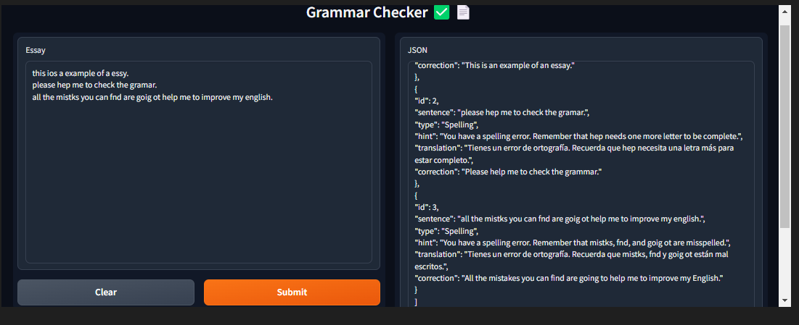

# Generative IA

## Projects 

#### Grammar Checker
This project is a "Grammar Checker" application that utilizes Python, OpenAI's GPT-3.5 API, and Gradio to create an interactive frontend. The application is designed to help you verify and correct the grammar of a provided text.




## Prerequisites

- Python 3.7 or higher
- Jupyter Notebook
- Python packages: openai, gradio

## Installation

To install and set up the project, follow these simplified steps:

1. Clone the repository to your local machine:


2. Create a virtual environment in the project's root directory. Use the appropriate command based on your operating system:

- For Windows:

  ```
  py -m venv venv
  ```

- For macOS and Linux:

  ```
  python3 -m venv venv
  ```

3. Activate the virtual environment. Run the following command in your terminal or command prompt:

- For Windows:

  ```
  .\venv\Scripts\activate
  ```

- For macOS and Linux:

  ```
  source venv/bin/activate
  ```


4. Install the project dependencies:
  ```
  pip install -r requirements.txt
  ```


5. Create an `.env` file in the root directory of the project and copy the contents of the `.env.example` file into the new `.env` file.

6. Generate your own [API KEY](https://platform.openai.com/account/api-keys) on the OpenAI platform.

7. Copy your OpenAI key and assign it as the value of the `OPENAI_API_KEY` variable in your `.env` file.

8. Navigate to the application folder.

9. Run the Jupyter Notebook.

10. Enjoy using the application!

Make sure to complete all the steps accurately to ensure the proper installation and functioning of the Grammar Checker application.